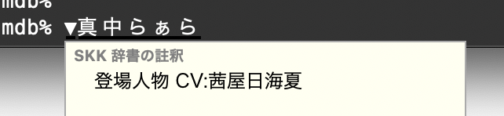

# skk-jisyo-prismdb

プリティーシリーズのSKK辞書です。SKK方式の入力メソッドの辞書として使用できます。
元データに [PrismDB](https://github.com/prickathon/prismdb) を使っています。

## 辞書

| ファイル名 | 辞書の内容 |
|---|---|
| [SKK-JISYO.prismdb.all.utf8](https://raw.githubusercontent.com/banjun/skk-jisyo-prismdb/master/SKK-JISYO.prismdb.all.utf8) | 下記全てを結合してソート済み |
| (To Be Generated) | 登場人物 |
| (To Be Generated) | 曲名 |
| (To Be Generated)  | : |

## 動作確認済みSKK

* [AquaSKK](https://github.com/codefirst/aquaskk)
* [FlickSKK](https://github.com/codefirst/FlickSKK)

## 謝辞

* [prickathon/prismdb](https://github.com/prickathon/prismdb) 元データ
* [project-brightblue/skk-dict-imascg](https://github.com/project-brightblue/skk-dict-imascg) SKK辞書レポジトリの構成・辞書ファイルの注釈等の参考